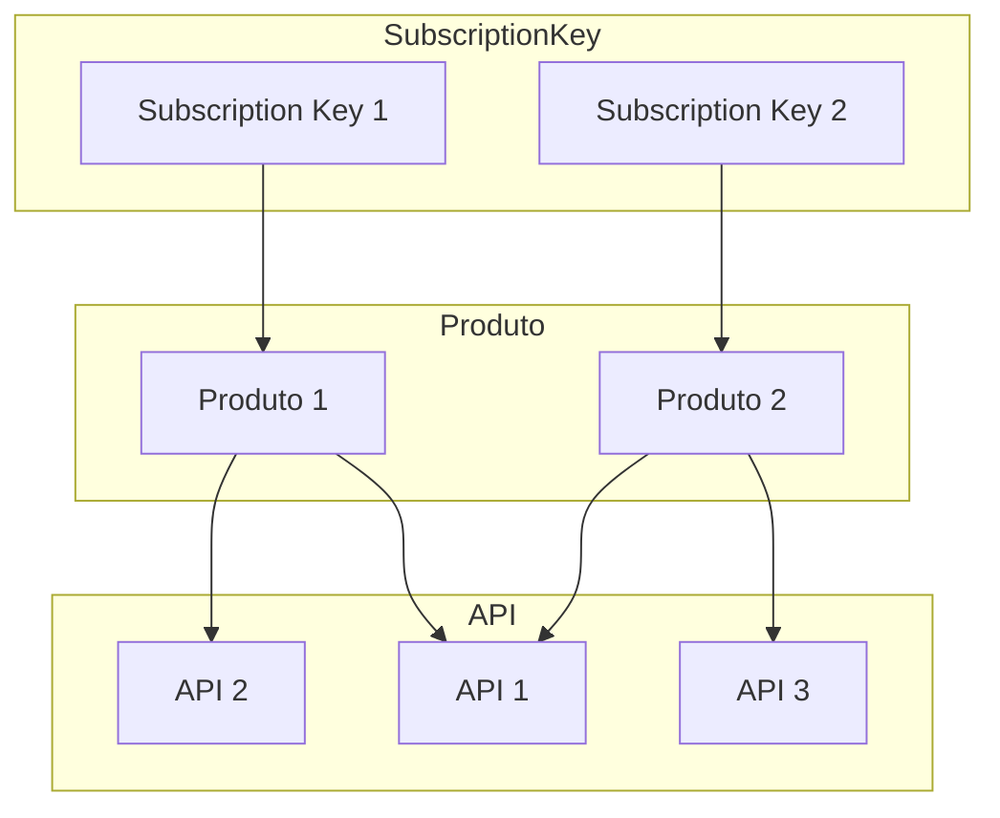

# Mermaid-AzureAPIM_Elements
Exemplo de Flowchart criado com Mermaid detalhando o relacionamento de elementos do Azure API Management (APIM): APIs, Products e Subscription Keys.

## Diagrama (código em Mermaid)

